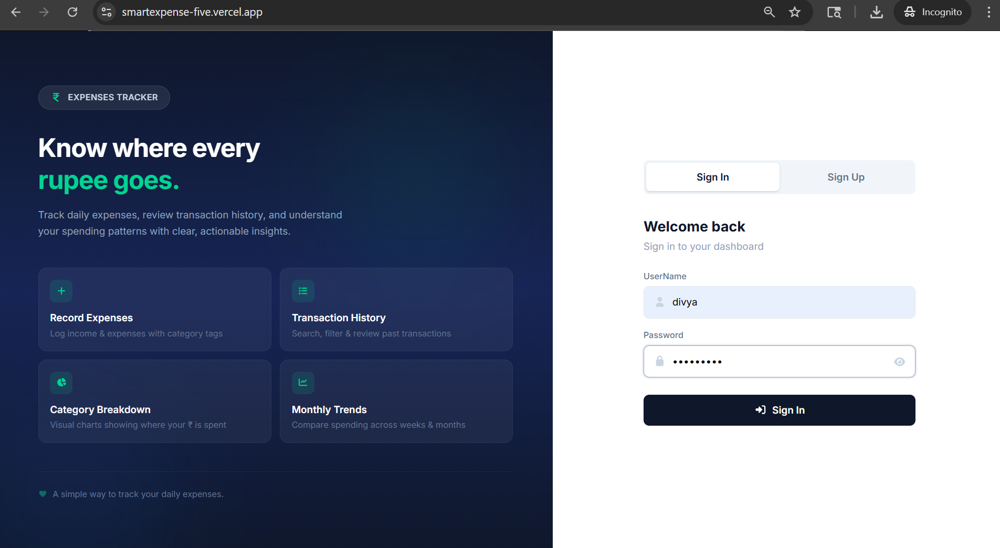
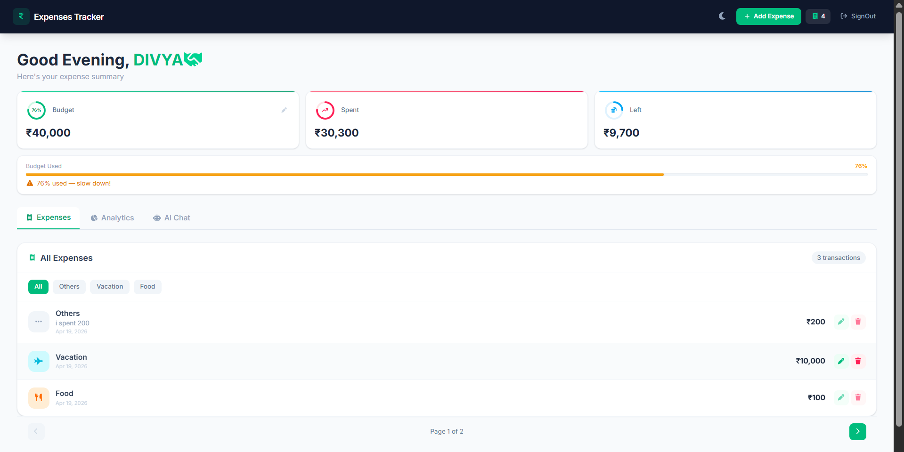
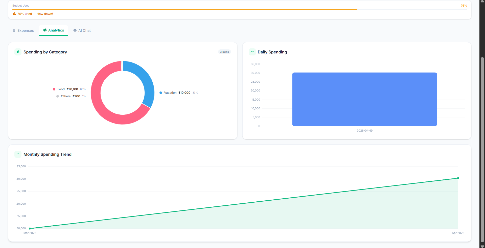
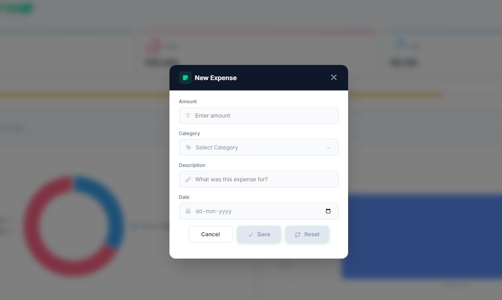
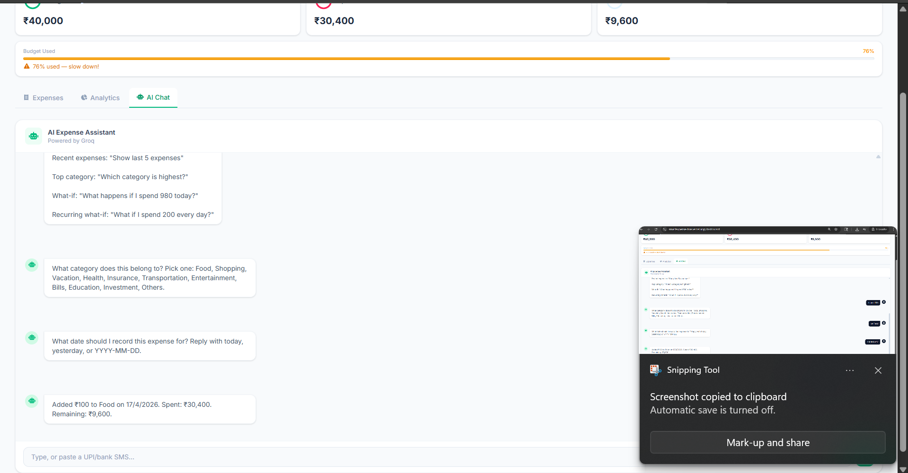

# Expenses Dashboard

A full-stack expense tracking application with budget analytics, interactive charts, and an AI-powered assistant that detects expenses from natural language.

## Screenshots



!




## Tech Stack

| Layer | Technology |
|-------|-----------|
| Frontend | Angular 21 (Standalone Components) |
| Styling | Tailwind CSS 4 |
| Charts | Chart.js + ng2-charts |
| Icons | FontAwesome |
| Backend | Node.js, Express 5 |
| Database | MongoDB + Mongoose |
| Auth | JWT (JSON Web Tokens) + bcrypt |
| AI | Groq API (Llama 3.3 70B) |
| Security | Helmet, Rate Limiting, CORS |

## Features

- **Authentication** — Sign up / sign in with hashed passwords and JWT tokens
- **Budget Management** — Set and update monthly budget with real-time tracking
- **Expense CRUD** — Add, edit, delete expenses with category tagging and date validation
- **Analytics Dashboard** — Doughnut chart (category breakdown), bar chart (daily spending), line chart (monthly trend)
- **AI Chat Assistant** — Natural language expense logging ("spent 500 on food") with automatic extraction and financial advice
- **Dark Mode** — Full dark theme toggle across all components
- **Responsive Design** — Mobile-first layout with collapsible navigation
- **Authorization** — Expense ownership validation on update/delete operations

## Project Structure

```
expenses-dashboard/
├── BackEnd/
│   ├── server.js              # Express server, middleware, DB connection
│   ├── api/
│   │   ├── user.js            # Auth endpoints (signUp, signIn, budget)
│   │   ├── expenses.js        # Expense CRUD endpoints
│   │   └── aichat.js          # AI chat with expense extraction
│   ├── middleware/
│   │   └── authmiddleware.js  # JWT verification
│   └── schemas/
│       ├── userSchema.js      # User model (userName, password, budget)
│       └── expenseSchema.js   # Expense model (amount, category, date)
│
└── FrontEnd/expenses-fe/
    └── src/
        ├── app/                # Root component and routing
        ├── components/
        │   ├── login/          # Authentication UI
        │   ├── header/         # Navigation, dark mode, sign out
        │   ├── add-expense/    # Expense form modal with validation
        │   └── user-content/   # Dashboard, charts, expense list, AI chat
        ├── services/
        │   ├── userService.ts       # Auth API calls
        │   ├── expensesService.ts   # Expense + budget + AI API calls
        │   └── auth.interceptor.ts  # JWT token injection
        ├── authguard/          # Route protection
        └── interfaces/         # TypeScript interfaces
```

## Getting Started

### Prerequisites

- Node.js 18+
- MongoDB (local or Atlas)
- Groq API key ([console.groq.com/keys](https://console.groq.com/keys)) — free tier

### Backend Setup

```bash
cd BackEnd
npm install
```

Create a `.env` file:

```
PORT=7000
MONGO_URI=your_mongodb_connection_string
jwt_secret_key=your_secret_key
GROQ_API_KEY=your_groq_api_key
ALLOWED_ORIGINS=http://localhost:5000
```

```bash
npm run dev
```

### Frontend Setup

```bash
cd FrontEnd/expenses-fe
npm install
ng serve
```

App runs at `http://localhost:4200`

### Running Tests

```bash
# Backend
cd BackEnd
npm test

# Frontend
cd FrontEnd/expenses-fe
ng test
```

## API Endpoints

| Method | Endpoint | Auth | Description |
|--------|----------|------|-------------|
| POST | `/api/signUp` | No | Create new user |
| POST | `/api/signIn` | No | Login, returns JWT |
| GET | `/api/get-user-budget` | Yes | Get user's budget |
| PUT | `/api/update-user-budget` | Yes | Update budget |
| POST | `/api/add-expense` | Yes | Add new expense |
| GET | `/api/get-all-expenses` | Yes | Get all user expenses |
| PUT | `/api/update-expense/:id` | Yes | Update expense (owner only) |
| DELETE | `/api/delete-expense/:id` | Yes | Delete expense (owner only) |
| POST | `/api/aichat` | Yes | AI chat with expense detection |

## Architecture Highlights

- **Standalone Components** — No NgModule, tree-shakable Angular 21 architecture
- **Typed API Layer** — All service methods return typed Observables (`Observable<Expense[]>`, `Observable<BudgetResponse>`, etc.)
- **Subscription Management** — `DestroyRef` + `takeUntilDestroyed()` on all subscriptions to prevent memory leaks
- **AI Two-Step Pipeline** — JSON mode extraction (guaranteed valid JSON) → keyword fallback → chat response
- **Defense in Depth** — Budget validation on both frontend and backend before expense creation
- **Rate Limiting** — Auth endpoints limited to 10 requests per 15 minutes
